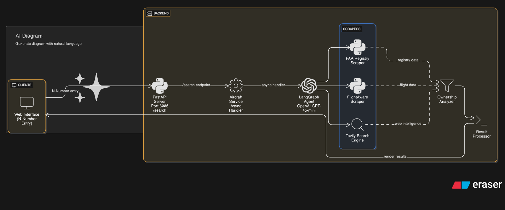

# Aircraft Ownership Research Agent

A sophisticated AI-powered agent built with LangGraph that researches aircraft ownership information using multiple data sources. Now available as both a command-line tool and a modern web application.

## Features

- **FAA Registry Scraping**: Extracts official aircraft registration data
- **FlightAware Integration**: Gathers operational and ownership data
- **Web Search**: Finds additional ownership and contact information using Tavily
- **Ownership Analysis**: Identifies decision makers and analyzes business entities
- **LangSmith Observability**: Full tracing and monitoring
- **Modern Web Interface**: Professional FastAPI application with real-time progress tracking
- **Docker Support**: Containerized deployment with web scraping capabilities

## Quick Start

### Prerequisites

- Python 3.8+
- Chrome browser (for web scraping)
- API Keys:
  - **OpenAI API Key** (required)
  - **Tavily API Key** (required for web search)
  - **LangSmith API Key** (optional, for observability)

### 1. Installation

```bash
git clone <repository>
cd aircraft_research_agent
```

### 2. Environment Setup

Copy `.env.example` to `.env` and configure your API keys:

```bash
cp .env.example .env
```

Required configuration:
```bash
# OpenAI Configuration
OPENAI_API_KEY=your_openai_api_key_here

# Tavily Configuration  
TAVILY_API_KEY=your_tavily_api_key_here

# LangSmith Configuration (optional)
LANGSMITH_API_KEY=your_langsmith_api_key_here
LANGSMITH_TRACING=true
LANGSMITH_PROJECT=aircraft-research-agent

# Application Settings
DEBUG=false
```

## Running Options

### Option 1: Command Line Interface

Install dependencies and run the CLI version:

```bash
# Create virtual environment
python -m venv venv
source venv/bin/activate  # On Windows: venv\Scripts\activate

# Install dependencies
pip install -r requirements.txt

# Run CLI demo
python main.py
```

### Option 2: FastAPI Web Application

#### Development Mode

```bash
# Install additional web dependencies
pip install fastapi uvicorn[standard] jinja2 python-multipart markdown pydantic-settings

# Run development server
python -m uvicorn app.main:app --reload --host 0.0.0.0 --port 8000
```

Access the application:
- **Web Interface**: http://localhost:8000
- **API Documentation**: http://localhost:8000/docs
- **Health Check**: http://localhost:8000/health

#### Production Mode

```bash
# Run with Gunicorn (install first: pip install gunicorn)
gunicorn app.main:app -w 4 -k uvicorn.workers.UvicornWorker --bind 0.0.0.0:8000
```

### Option 3: Docker

#### Build and Run Manually

```bash
# Build the Docker image
docker build -t aircraft-research-api .

# Run the container
docker run -p 8000:8000 --env-file .env aircraft-research-api
```

#### Using Docker Compose (Recommended)

```bash
# Build and start services
docker-compose up --build

# Run in background
docker-compose up -d

# View logs
docker-compose logs -f

# Stop services
docker-compose down
```

The Docker setup includes:
- Chrome browser for web scraping
- All required dependencies
- Health checks
- Non-root user for security
- Shared memory configuration for Chrome stability

## Architecture

### Directory Structure

```
aircraft_research_agent/
├── app/                           # FastAPI web application
│   ├── main.py                   # FastAPI app entry point
│   ├── api/routes.py             # API endpoints
│   ├── core/config.py            # Configuration management
│   ├── services/aircraft_service.py # Business logic
│   └── templates/                # HTML templates
├── agent/                        # LangGraph agent implementation
│   ├── graph.py                  # Agent workflow
│   └── prompts.py               # System prompts
├── tools/                        # Research tools
│   ├── faa_scraper.py           # FAA registry scraper
│   ├── flightaware_scraper.py   # FlightAware scraper
│   ├── tavily_search.py         # Web search tool
│   └── ownership_analyzer.py     # AI analysis tool
├── models/schemas.py             # Data models
├── utils/                        # Utilities
├── static/                       # Web assets (CSS, JS)
├── main.py                       # CLI entry point
├── requirements.txt              # Python dependencies
├── Dockerfile                    # Container configuration
├── docker-compose.yml            # Multi-container setup
└── .env                         # Environment variables
```

### Research Tools

1. **FAA Registration Scraper**
   - Scrapes official FAA aircraft registry
   - Extracts owner, manufacturer, model details
   - URL: `https://registry.faa.gov/AircraftInquiry/Search/NNumberResult`

2. **FlightAware Scraper**
   - Gathers operational data and additional owner info
   - Uses Selenium for dynamic content
   - Multiple extraction strategies for robust data collection
   - URL: `https://www.flightaware.com/resources/registration/`

3. **Tavily Ownership Search**
   - Web search for additional ownership information
   - Extracts contact details (email, phone, LinkedIn)
   - Searches for business entity information

4. **Ownership Analyzer**
   - Analyzes data from multiple sources
   - Identifies likely decision makers
   - Calculates confidence scores
   - Determines business entity types

## Usage Examples

### Web Interface

1. Navigate to http://localhost:8000
2. Enter aircraft N-number (e.g., N540JT)
3. Watch AI agents work through research phases
4. Review comprehensive results with evidence links

### API Usage

```bash
# Search for aircraft information
curl -X POST "http://localhost:8000/search" \
     -H "Content-Type: application/x-www-form-urlencoded" \
     -d "n_number=N540JT"

# Health check
curl http://localhost:8000/health
```

### Programmatic Usage

```python
from agent.graph import AircraftResearchAgent

agent = AircraftResearchAgent()
result = agent.research_aircraft("N540JT")
print(result)
```

## Configuration

### OpenAI Model Options

The agent supports multiple OpenAI models:

```python
# Cost-effective (default)
agent = AircraftResearchAgent(model_name="openai:gpt-4o-mini")

# Higher quality
agent = AircraftResearchAgent(model_name="openai:gpt-4")

# Most economical
agent = AircraftResearchAgent(model_name="openai:gpt-3.5-turbo")
```

### Cost Considerations

Approximate costs per research session:
- **GPT-4o-mini**: $0.002 - $0.008 (recommended)
- **GPT-4**: $0.15 - $0.30 (premium quality)
- **GPT-3.5 Turbo**: $0.003 - $0.015 (most economical)

### Logging Configuration

Logs are written to both console and files. Configure logging levels:

```python
# In your .env file
DEBUG=true  # Enables debug logging
```

## Data Sources

### Primary Sources
- **FAA Aircraft Registry**: Official US aircraft registration database
- **FlightAware**: Aviation data and aircraft tracking platform

### Secondary Sources
- **Web Search (Tavily)**: General web search for ownership details
- **Business Registries**: Company information and contacts

## Output Format

The agent returns comprehensive research results:

```json
{
  "n_number": "N540JT",
  "aircraft_details": {
    "manufacturer": "Cessna",
    "model": "Citation",
    "year": "2015"
  },
  "ownership_info": {
    "primary_owner": "ACME Aviation LLC",
    "decision_maker": "John Smith",
    "role": "CEO",
    "company_type": "LLC",
    "confidence_score": 0.85
  },
  "contact_info": {
    "email": "john@acmeaviation.com",
    "phone": "555-123-4567",
    "linkedin": "linkedin.com/in/johnsmith"
  },
  "evidence_links": [
    "https://registry.faa.gov/...",
    "https://acmeaviation.com/about"
  ]
}
```

## Docker Configuration

### Dockerfile Features

- **Chrome Integration**: Includes Google Chrome for web scraping
- **Security**: Runs as non-root user
- **Health Checks**: Built-in application monitoring
- **Optimized Layers**: Efficient build caching

### Docker Compose Services

```yaml
services:
  web:
    build: .
    ports:
      - "8000:8000"
    environment:
      # Environment variables from .env file
    volumes:
      - /dev/shm:/dev/shm  # Shared memory for Chrome
    restart: unless-stopped
    healthcheck:
      test: ["CMD", "curl", "-f", "http://localhost:8000/health"]
```

## Development

### Adding New Tools

1. Create a new tool class inheriting from `BaseResearchTool`
2. Implement the `_run` method with proper error handling
3. Add logging and field annotations
4. Register the tool in the agent configuration

### Testing

```bash
# Run unit tests
pytest tests/

# Test individual components
python -c "
from tools.faa_scraper import FAARegistrationScraper
scraper = FAARegistrationScraper()
result = scraper._run('540JT')
print(result)
"
```

### Frontend Development

The web interface uses:
- **Tailwind CSS**: For styling
- **Vanilla JavaScript**: For interactivity
- **Jinja2 Templates**: For server-side rendering
- **Markdown Rendering**: For AI response formatting

## Troubleshooting

### Common Issues

1. **Chrome Driver Issues**
   ```bash
   # Update webdriver manager
   pip install --upgrade webdriver-manager
   ```

2. **Docker Memory Issues**
   ```bash
   # Increase Docker memory allocation to 4GB+
   # Add to docker-compose.yml:
   shm_size: 2g
   ```

3. **API Rate Limits**
   - Check your OpenAI and Tavily API quotas
   - Monitor usage in respective dashboards

4. **Import Errors**
   - Ensure all `__init__.py` files exist
   - Verify PYTHONPATH includes project root

### Health Monitoring

```bash
# Check application health
curl http://localhost:8000/health

# View Docker logs
docker-compose logs web

# Monitor resource usage
docker stats
```

## Limitations

- Currently US-only aircraft support
- Requires stable internet connection for web scraping
- Rate limits apply to external APIs
- Some aircraft may have limited public information
- Chrome dependency for FlightAware scraping

## Security Considerations

- API keys stored in environment variables
- Non-root Docker user
- Input validation on N-numbers
- No persistent data storage
- CORS configuration for production

## Contributing

1. Fork the repository
2. Create a feature branch
3. Add tests for new functionality
4. Ensure Docker build succeeds
5. Submit a pull request

## License

[Add appropriate license]

## Support

For issues and questions:
1. Check application logs: `docker-compose logs`
2. Verify API keys are correctly configured
3. Ensure Chrome is properly installed (for Docker)
4. Check LangSmith traces for debugging (if enabled)
5. Review health check endpoint: `/health`

## Roadmap

- [ ] Support for international aircraft registries
- [ ] Enhanced entity resolution algorithms
- [ ] Real-time data caching
- [ ] Multi-language support
- [ ] Enhanced contact information validation
- [ ] Support for corporate hierarchy analysis
- [ ] API rate limiting and throttling
- [ ] Database integration for result caching

## Design
## System Architecture


*Figure 1: Complete system architecture showing data flow, components, and deployment options*